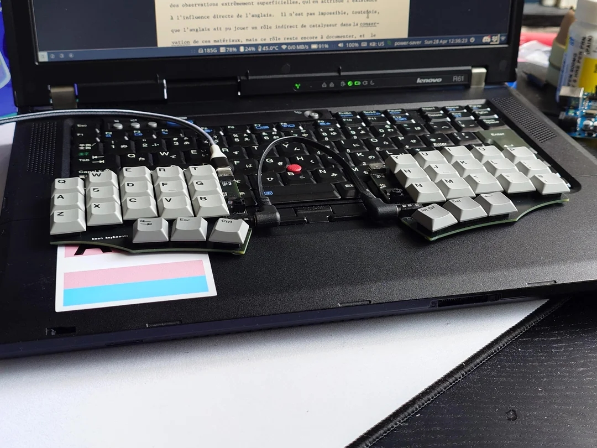

# disable-enable-thinkpad-keyboard
Utility to disable/enable the Lenovo Thinkpad P1 laptop

-----------------
I made this utility for my personal working setup based on the excellent guideline at https://askubuntu.com/a/713597/1847263.
In this setup, I places the 2 splits of the Corne over the laptop's keyboard similar to the below image.

So I just want to **disable the laptop's keyboard at that time and re-enable it after that**.
## Usage
1. First, you have to find your keyboard id with `xinput list` command.
2. Once you identified the laptop's keyboard id, change the `disable_enable_keyboard.sh` script according to that value.
3. Also change the icons' path accordingly.
4. Place the `disable_enable_keyboard.desktop` in ~/.local/share/applications/
5. Update the system's desktop: `update-desktop-database ~/.local/share/applications/`
6. Run the **Keyboard Laptop ON-OFF** to disable/enable the laptop's keyboard.
